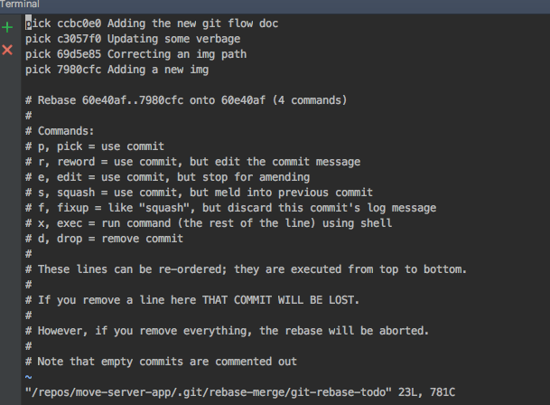
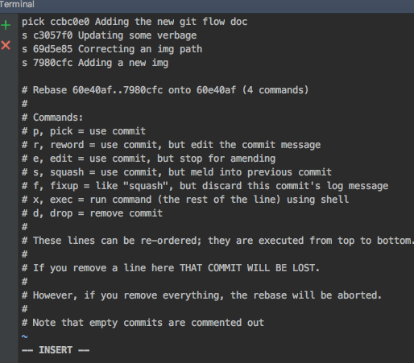

# Git Flow for PointC Engineering 

This document is a description of the typical developer git work flow. 

The basic flow is:

    1.  Checkout a local copy of the master branch
    2.  Create a local branch for your work
    3.  Set the upstream of your local branch
    4.  Commit your code to the local branch
    5.  Push your code to your remote branch
    6.  Create a "Pull Request" branch from your local branch
    7.  Ensure all the tests pass and code is formatted correctly
    8.  Organize your commits (rebase i) appropriately
    9.  Push your "Pull Request" branch
    10. Go to git hub and set up a "pull request" notification for a reviewer  

The process describes the following:
    
    * branching 
    * merging
    * rebasing
    * rebasing interactive
    * pull, commit, push
    * squashing
    * setting up a branch for "pull requests"

As with everything, there are more ways than one to accomplish a specific task using git. 
The remainder of this document is one way you may choose to interact with git during your
daily development activities. 

For a deeper dive into the various tools, tips and tricks of git, 
navigate to the [Git official documentation](https://git-scm.com/documentation) and enjoy.

## Document Conventions

    * CLI : command line interface
    * all executable commands are in **bold** typeface 

## Common git commands defined

__pull__ : Fetches the files from the remote repository and merges it with your local one. 

Example: __git pull__

__push__ : Pushes all the modified local objects to the remote repository and advances its branches. 

Example: __git push__

__clone__ : Creates a GIT repository copy from a remote source. Also adds the original receivingAtLocation as a remote so you can fetch from it again and push to it if you have permissions. 

Example: __git clone git@github.com:user/test.git__

__status__ : Shows you the status of files in the index versus the working directory. It will list out files that are untracked (only in your working directory), modified (tracked but not yet updated in your index), and staged (added to your index and ready for committing). 

Example: __git status__

__commit__ : Takes all of the changes written in the index, creates a new commit object pointing to it and sets the branch to point to that new commit. 

Example: __git commit -m ‘committing added changes’__

__branch__ : Creates a new branch if a branch name is provided. 

Example: __git checkout -b jason/dev666__

__reset__ : Resets your index and working directory to the state of your last commit. 

Example: __git reset --hard HEAD__

__log__ : Shows a listing of commits on a branch including the corresponding details. 

Example: __git log__

__Note__: Most of these command have one or many modifying flags that can be used to alter the behavior of the command. These can be found in the "man" pages. (man git)

## Local vs Remote

A local branch is a branch that only you (the local user) can see. It exists only on your local machine.

CLI: __git checkout -b myNewBranch__

A remote branch is a branch on a remote receivingAtLocation (in most cases origin). You can push the newly created local branch myNewBranch to origin. Now other users can track it.

CLI: __git push -u origin myNewBranch__
     

## Checkout Master 

A developer must first check out the master branch to get the latest and greatest to build upon. 
Execute the following command to create a local copy of the master branch:

CLI: __git checkout master__ 

Now that you have the master branch, it will be up to date with the latest code. 
However, it is a good practice to immediately update the master branch by executing a "pull" command.

CLI: __git pull__

You will see some output regarding the result of you pull.

e.g.  

> Dev-MacBook-Pro:app dev$ git pull

> remote: Counting objects: 407, done.

> remote: Compressing objects: 100% (188/188), done.

> remote: Total 407 (delta 132), reused 386 (delta 111), pack-reused 0

> Receiving objects: 100% (407/407), 71.38 KiB | 1001.00 KiB/s, done.

> Resolving deltas: 100% (132/132), completed with 23 local objects.

> From github.com:pointc-io/some-app

>   7877c1c..d0d19ec  feature/change-the-world -> origin/feature/change-the-world

> Already up-to-date.

## Create a Working Branch

All of the code that you produce to complete a user story will be done in a local branch.
The naming convention for working branch is : your first name/jira issue number

for example: jason/dev666

To create the branch from local master execute:

CLI: __git checkout -b feature/change-the-world__

This creates you local branch of your own called feature/change-the-world, now you can start committing code.

## Committing Code Locally

This can be done using the "Version Control" tab of IntelliJ / GoLand. 
Right click on the file or files that you wish to commit locally and select "commit". __DO NOT "PUSH"__.
"Push" will be discussed later in this document.

Follow the instructions from the wizard and leave a meaningful comment, in the following format:
JIRA ISSUE: Meaningful comment about the check in

e.g.
DEV-666: Add CSS to new grid, wip.

Continue with this process until all the code for the story has been completed. 
Ideally, this process should be done several times per day.

## Committing to the Remote Branch

Committing locally is important to help the developer  organize their work, the code __MUST__ be 
committed to the remote branch regularly. This serves to protect the code in case you laptop is lost or damaged.

The commit the the remote branch we must set the upstream for our local branch, execute:

CLI: __git push -u origin jason/dev666__

This command sets you branches origin as well as pushes your current code to the remote receivingAtLocation.

For all subsequent pushes you will only need to execute:

CLI: __git push__

__This should be done at least on a daily basis.__ 

Now the code is now safely in git hub. You can go to the git hub website and see the results of these actions.

## Keeping Up To Date With Master

When you return to office after a restful nights sleep you will want to begin coding again. 
The first thing you must do is update you remote branch.

To accomplish this, execute the following commands sequentially:

CLI: __git checkout master__

CLI: __git pull__

CLI: __git checkout jason/dev666__

CLI: __git rebase master__

[Learn about rebasing] ( https://git-scm.com/docs/git-rebase )

You are now ready to begin coding again. 
Follow these previous actions until you are ready to submit your code for review.

## Pushing your Code for Review (Rewriting History)

Read this git documentation on interactive rebasing before you complete this section.
[Git Documentation] ( https://git-scm.com/book/en/v2/Git-Tools-Rewriting-History )

Once you have completed all the required code your story, all the tests are passing, 
and your code is formatted via IntelliJ's "Reformat Code" feature, you are going to submit it for review. 
This will require that you create a "PULL REQUEST" branch. 

### Create a "pull request" branch

Execute the following steps sequentially:

CLI: __git checkout master__

CLI: __git pull__

CLI: __git checkout jason/dev666__

CLI: __git rebase master__

CLI: __git checkout -b pr/dev666__

### Squashing Commits

During the course of development there may be dozens of check ins that represent the to totality of the final solution.
Each of these commits will have their own meaningful commitment messages. However, we now want to create single 
commitment message to reflect the nature of the last commit for review. This is accomplished using the git feature
known as "interactive rebase".

Execute the following steps to "Squash" your commits in a single commit:

CLI: __git rebase -i HEAD~3__ (The 3 represents the number of commits that you wish to squash into commit)

The following flow represents 4 earlier commits being squashed into one.

CLI: __git rebase -i HEAD~4__

terminal view:

Squash three of the four commits into one by editing (VI editor, "i" for insert) 
and changing the preface from 'pick' to 's'

Close the editor (esc + :qw), you will be presented another terminal view, via VI, listing all the existing 
check in comments.

You can either choose one of the existing comments or remove them all and create a new one, still using the message pattern (DEV-666: some message).

Once again, exist the VI editor and your interactive rebase is complete. Verify your squash by
view the Version Control log in intelliJ.

NOTE: The files should be squashed in order of oldest into the youngest. Reorder the commits inside VI, if required. 
This activity can be done on your "pull request" to prepare for the review process.

[Very through explanation of interactive rebasing]( https://robots.thoughtbot.com/git-interactive-rebase-squash-amend-rewriting-history )

##  Setting up a "Pull Request"

Once you interactive rebase is complete, you can push your code to the remote branch:

CLI: __git push__

Once your push is successful, login to the github website and locate your branch. 

Click the "New Pull Request" button, leave a comment, select a reviewer and submit the request.

## Organizing your Commits

The goal of this entire process is to provide concise, well organized commit or set of commits for reviewers. 
Fortunately, git provides mechanisms for achieving this goal.

In the following link, you will find an example of a complex commit being organized and shaped into a much more meaningfully 
series of commits. 

[github Help for rebasing](https://help.github.com/articles/using-git-rebase-on-the-command-line/)  

This example shows such useful commands as "fixup", "edit", "reword" and "pick". 
All of these commands should be understood by a developer using git hub.

## Useful Vi commands

    * i - insert mode
    * yy - copy text
    * dd - delete line
    * p - paste text
    * esc - escape insert mode
    * :wq - write and quit editor
    * !q - quit editor
    
    

 

 
      